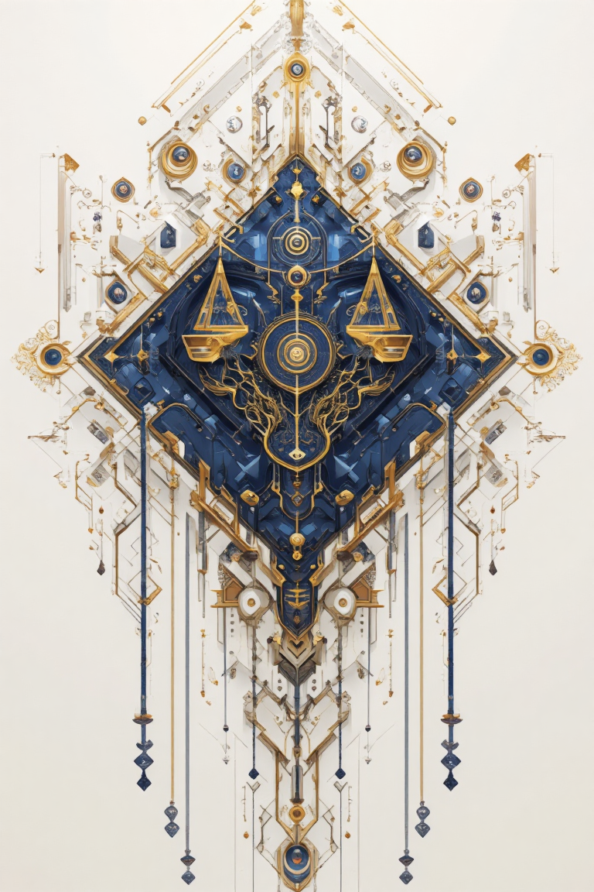

# Nexarion (temporary name)

This is a repo hosting a set of sort-of design documents for an experimental indie game project. The game is intended to be like [Uncharted Waters IV](https://store.steampowered.com/app/1424800/Uncharted_Waters_IV_HD_Version/), but in a far-future setting and with some slightly different mechanics.

Motivated by the disappointing PC remaster / port of Uncharted Waters IV.

## Noteworthy design documents

Trade System Balancing Sheet: [Google Sheet](https://docs.google.com/spreadsheets/d/1UFZz6B97ojAMlQY8WkVzC41KoKGSq5iycUdhuf7L4mo/edit?usp=sharing).

General ideas of designs: [general ideas.md](./designs/general%20ideas.md), following the Design Lenses method.

## A peek at the narrative

The narrative is a space opera. The world is a fairly explored universe. There are a few mutually known races, some sovereignties and a large amount of established settlements. There are more "inland" settlements on planets that are not natrually well equipped for trading hubs, and "ports" that see heavy commercial traffic everyday. The story of this game will happen mostly in "port" settlements.

More details in [the narrative texts.drawio](./designs/narrative%20texts.drawio) diagram.

**Races**:

Only listing some active ones. All are temporary names.

- Humans  
    Descendants of old earth humans that found colonies near the Solar system, with traits like horns, bio-luminescent veins, and neural crests inherited as side effects of long-term genetic optimization.
- Hydrune  
    Descendants of old earth humans who re-engineered themselves to adapt to their water-rich planets after the collapse.
- K'tharr  
    Natrually evolved "lizard" people.
- Heliox  
    Naturally evolved "energy ball" people from a radiation-dense stellar cluster.
- Archelect  
    Synthetic folks that are not too different thant those we all know and love in various space operas.
- Xyleth  
    Natrually evolved "plant" folks.
- Veydrin  
    Biologically unstable creatures composed of semi-autonomous sentient matter, or "sporeling" people though they also look a bit like mini nebulas.

**Sovereignties (factions)**:

Only listing some active ones. All are temporary names.

- The Ordis Lexis  
    Allied republics, like spacefaring ancient Rome meets a Renaissance republic.

- FES (The Federation of Enlightened Systems)  
    Loose alliance, like modern Europe / ancient Greece.

- The Myrwarden Commonwealth  
    Ancient aristocracy with divine / worshipped monarchy and rigid caste structure, a bit like ancient Egypt or China.

- The Abyssal Syndic 
    Mercenary alliance and corporate syndicate with decentralized power nodes.

- The Cosma Chorus  
    Decentralized, knowledge-sharing coalition of planetary enclaves.

    Temporary emblems, made using variants of SDXL. Will be replaced with manually designed ones some day if the project continues, or removed if not.

    | | | | | |
    | -------- | ------- | ------- | ------- | ------- |
    |Ordis Lexis| FES | Myrwarden C. | Abyssal Syndic | Cosma Chorus  |
    |||||

**Geopolitical conflicts**:

Temporary.

| | | |
| -------- | ------- | ------- |
| Myrwarden Commonwealth    |  vs  | FES + Cosma Chorus |
| Ordis Lexis               |  vs  | Abyssal Syndic |
| Some humans (FES human-heavy states)  |  vs  | Archelects (Cosma Chorus) |
| Some of FES (authoritarian states)  |  vs  | big warlords of The Abyssal Syndic |
| Most other races  |  distrust / disdain  | the Veydrin race |